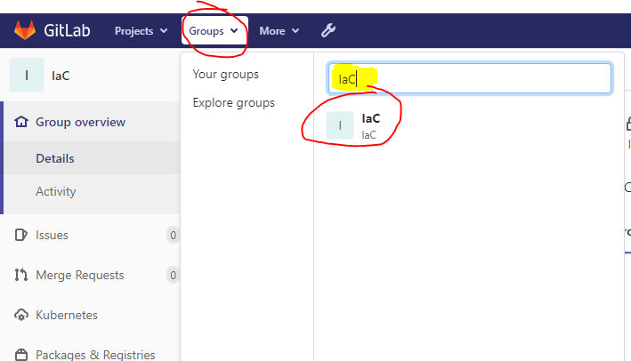
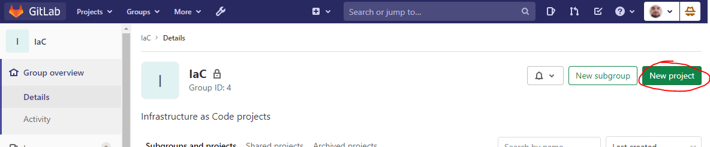
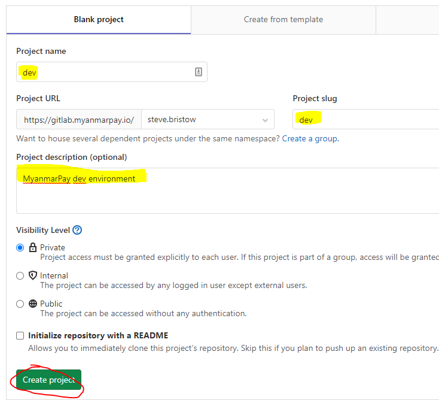
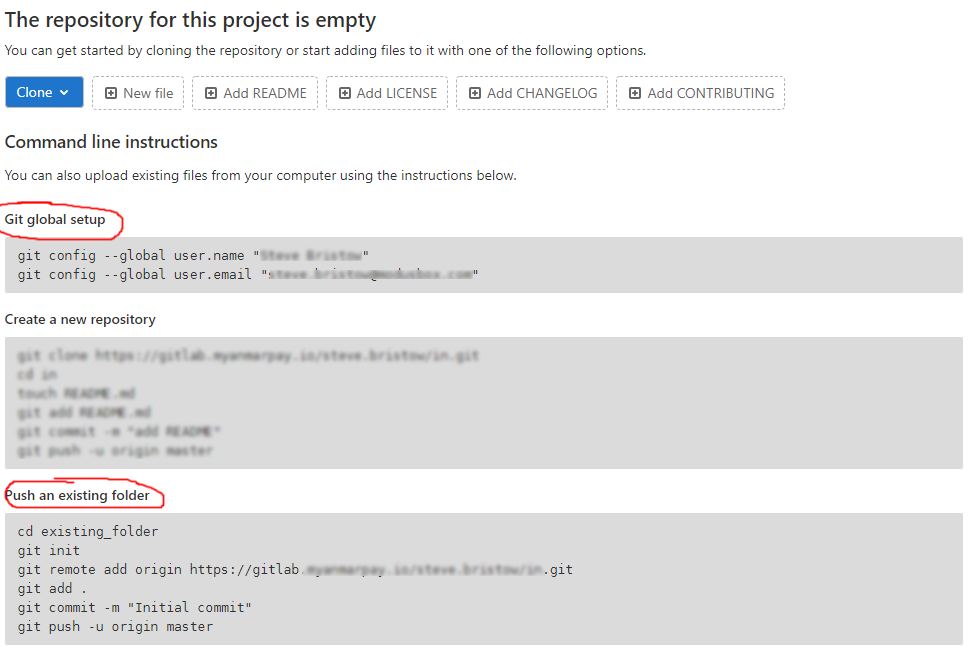
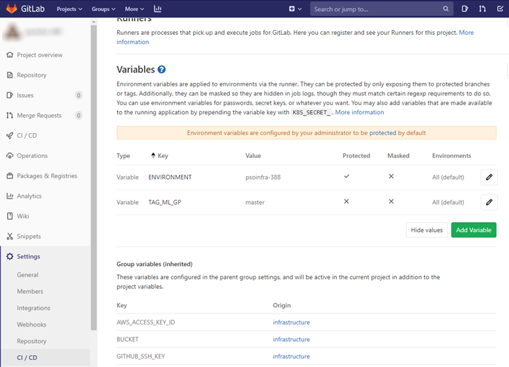
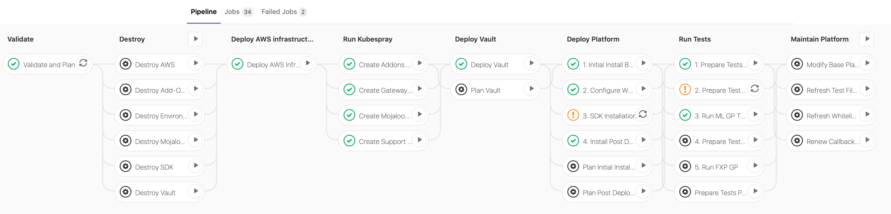

# Deploying a Mojaloop Environment

## Pre-Requisites (before deploying an environment)

 mojaloop-bootstrap v0.6.3 should already be deployed

:warning: _The process requires re-running of mojaloop-bootstrap v0.6.3.  As such, the software requirements for mojaloop-bootstrap MUST be met_

For more information, see: <https://modusbox.atlassian.net/wiki/spaces/CK/pages/610796145/Creating+a+Mojaloop+platform+for+a+client>

For mojaloop-bootstrap:
<https://github.com/mojaloop/iac-aws-bootstrap#readme>

## 1. Preparation

### Creating a Slack Channel with WebHooks

Create a webhook for slack notifications on this page: <https://api.slack.com/apps/A019UEZ37MW/incoming-webhooks>

If the notification channel for this env doesn’t exist, create the channel in the slack along this format:

grafana-alerts-${`env.name`}-${`tenancy.name`}

Create a webhook and associate it with the new channel above.
Keep a copy of the WebHook URL.     You will need it later.

### Preparing local bootstrap
If you have not previously deployed an environment into this Tenant, you will need to pull bootstrap from the tenant repository:

1. Create a local folder (typically `/tenant/bootstrap`), and clone the bootstrap repo from the existing tenancy (i.e. Tenant GitLab)
2. From within this folder, run: `terraform init --backend-config=backend.hcl`
    This will ensure bootstrap can access the state stored in S3, as well as pulling any relevant modules.

    >:warning: Terraform statefiles are locked to specific versions of terraform. It is highly possible the version installed locally will need to be upgraded or downgraded to suit - the error will state that the terraform version (x.xx.x) does not match the version that created the statefile (y.yy.y) and the init will fail. Note - DO NOT upgrade the statefile unless all associated repos have had TF code upgraded.
    Terraform versions can be downloaded from: <https://releases.hashicorp.com/terraform/>

_If you have an existing clone of the Tenancy bootstrap, ensure it is fully synchronised with the repo in gitlab._

### Creating a Repository

* Download <https://github.com/mojaloop/iac-aws-platform/releases> latest release.

* Move the downloaded archive to the **client** directory, extract the archive and rename the directory to the name of the env you want to build:

    ```bash
    cd my_corp_client
    mv ~/Downloads/mojaloop-platform-iac-3.7.0.tar.gz .
    tar -xf mojaloop-platform-iac-3.7.0.tar.gz
    mv mojaloop-platform-iac-3.7.0 dev
    cd dev
    ```

* Locally copy `%tenant%/bootstrap/backend.hcl` to `%tenant%/%environment%/backend.hcl` (e.g. `cp /modusbox/bootstrap/backend.hcl /modusbox/dev/backend.hcl`)

* Edit the `workbench-config.json` as required. At the very least you need to edit the following fields:

|         field                                  |        Notes                                       |
|------------------------------------------------|----------------------------------------------------|
| `“client": ”<placeholder>”`                    |  The Client name - usually the DNS name of the TENANT |
| `“environment": ”<placeholder>”`               |  The environment name: dev, qa, prod etc |
| `“region": ”eu-west-1”`                    |  If you need to edit region you __must__ also edit the aws_ami field below  |
| `“aws_ami": ”ami-0e219142c0bee4a6e”`           |  If you need to edit region you must also edit aws_ami. To find the AMI you need to search here for `“<your-region> bionic amd64 hvm:ebs-ssd”` and paste the AMI. |
| `"nexus_ip": "<placeholder>"`                  |  See the "deploying nexus guide" in [mojaloop-bootstrap](https://github.com/mojaloop/iac-aws-bootstrap/blob/master/documents/d30.deploying_nexus.md)       |
| `"nexus_port": "<placeholder>"`                |  See the "deploying nexus cache guide" in [mojaloop-bootstrap](https://github.com/mojaloop/iac-aws-bootstrap/blob/master/documents/d30.deploying_nexus.md) |
| `"grafana_slack_notifier_url": "\<placeholder>"` |  Use the WebHook URL from Step 1                    |
| `"hub_currency_code": "USD"`                    |  If the deployment requires a currency other than USD it should be set here |
---

*  If you need to edit region you must also edit aws_ami. To find the AMI you need to search here for `"<your-region> bionic amd64 hvm:ebs-ssd"` and paste the AMI.
 Use the following tool:
 https://cloud-images.ubuntu.com/locator/ec2/
 

## 2. Adding the mojaloop environment repository to GitLab

From the "groups" menu, select the "IaC" group

Create a "New Project"


1. Name the project the same as the environment you are creating (i.e. `“dev”`).
    

2. Follow the instructions to push an existing folder:
    

3. Add the following CI/CD variables to the repo:

    |         Variable           |      Content         |
    |----------------------------|----------------------|
    | ENVIRONMENT                | Name of the environment |
    | TF_VAR_environment         | Name of the environment |
    | TF_VAR_region              | AWS region           |

If the bootstrap guide has been followed, `GITHUB_SSH_KEY` should be **no longer be neccessary**
*(available in 1Password \ infra-devops \ GitLab SSH Key IaC)* This should be defined at the “group” level, and is not needed in each project.



## 3. Re-running the bootstrap

For each environment within a tenant, the client-level bootstrap needs to be modified and re-run to add the networks to the vpc. The existing bootstrap is stored in the same repo the new environment will be created in, usually inside the same “Group”.

1. Modify the “environments” entry in `main.tf` to add the new environment:

    ```terraform
    environments          = ["confd", "releases", "psoinfra-291", "psoinfra-307"]
    ```

2. Commit this back to the repo (a commit to master is acceptable as only one instance of bootstrap should exist in the tenant)
3. Run `terraform plan` within the bootstrap directory to verify that the new networks and ACLs will be created - verify that *no other environments* are being altered.
4. As long as no other environments are being altered - run `terraform apply`

## 4. Running the CI/CD jobs to create the environment

Most of the time we will start from this step (Because we are not destroying Gitlab)
> :warning: CAUTION: GitLab provides a “Cancel” button for jobs running within the CI/CD pipeline. It is STONGLY advised that you do not cancel a CICD job - it is generally simpler to allow it to fail naturally (or complete) and clean up any damage, rather than dealing with the consequences of cancelling a job, which can include issues with Terraform State locks, and potentially inconsistent state. You have been warned.

Once the Validate and Plan job completes all the other jobs become available. To deploy the environment you must run the Deploy AWS Infrastructure, Run Kubespray, Deploy Vault and Deploy Mojaloop pipelines in that order.



### PIPELINE ORDERING

#### Creating the infrastructure:
1. Run [ Deploy AWS Infrastructure ]
2. Run [ Kubespray ]
3. Run [ Deploy Vault ]

#### Deploy Platform :
4. Run [ 1.Initial install Base Platform ]
5. Run [ 2.Configure WSO2 External Gateway ]
6. Run [ 3.SDK Installation ]  ~~ see troubleshooting ~~
7. Run [ 4.Install Post Deployment ]

#### Run Tests :
8. Run [ 1.Prepare Tests Hub Setup ]
9. Run [ 2.Prepare Test Sim Onboarding ]  ~~ see troubleshooting ~~
10. Run [ 3.Run ML GP Tests ]

>:boom:__[ Prepare Tests Hub Setup ]__ may encounter upto __6__ assertion failures.  These are expected, and can be ignored in this release.

>:boom:__[ Prepare Tests Sim ]__ may encounter upto __27__ assertion failures.  These are expected, and can be ignored in this release.

## 5. Troubleshooting Tips

["Validate and Plan" errors](./d20.docs/d20.01.validate_and_plan.md)

["Deploy AWS" errors](./d20.docs/d20.02.deploy_aws.md)

[Terraform State errors](./d20.docs/d20.03.tf_state.md)

["Installl Post Deployment" errors](./d20.docs/d20.04.post_deploy.md)

["Prepare Tests Hub Setup" errors](./d20.docs/d20.05.tests_hub.md)

["Prepare Tests Sim Onboarding" errors](./d20.docs/d20.06.tests_sim.md)

["Prepare Tests FXP Onboarding" error](./d20.docs/d20.07.tests_fxp.md)

["SDK Deployment" error](./d20.docs/d20.08.deploy_sdk.md)

## 6. Enabling FXP

By default FXP is disabled. To enable FXP you must set `enable_fxp = true` in `terraform/k8s-setup/addon/terraform.tfvars`.

See also ["Prepare Tests FXP Onboarding" error](./d20.docs/d20.07.tests_fxp.md)

## 7. Enabling SDKs

By default SDKs are disabled. To enabled SDKs you must supply a list of objects with the required parameters (one object per SDK required). This is set in the `sdks` variable in `terraform/k8s-setup/addon/terraform.tfvars`. Example parameters and values are provided in that file to assist with this.

See also ["SDK Deployment" error](./d20.docs/d20.08.deploy_sdk.md)

## 8. Testing

Once all the tasks above are done you will have an environment that has a working Mojaloop setup ready for you to use - now would be a good time to run some of the tests against it to validate it’s integrity.

## 9. Document the configuration

Configuration should be captured ready for teams who will support the platform, for example at the [TechOps environments page](https://modusbox.atlassian.net/wiki/spaces/MOT/pages/971669746/Environment+Information)

For information on how to locate service endpoint URLs see the page [How to find mojaloop platform deployment endpoints](https://modusbox.atlassian.net/l/c/F5SvcrSt)
