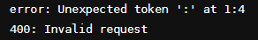

# ERRORS DURING "PREPARE TESTS HUB SETUP"

If the following error is encountered during the "Prepare Tests Hub Setup" phase....

....re-check the environment variables in gitlab (specifically check `TAG_GP` and `TAG_ML_GP` as the error indicates an inability to pull from GitHub)   See Step 2 above.
