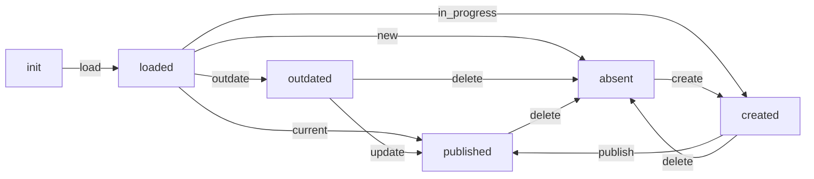

# WSO2 API Publisher

Update WSO2 API gateway with API definition from Mojaloop

## Description

With a given API template file (JSON) will publish or delete API. When publishing an API both the URL to get the API definition and the endpoint URL from is required. Adding mediations is supported. Will publish a new API if the API definition version does not match what is on Mojaloop. Will publish a new API if the API mediations are changed (specifically the names)

## Requirements

The ansible module, it's dependencies and playbooks are all self contained. The only parameter you need to provide is the domain name for the environment it needs to work in. 

## Usage

Execute one of the two provided playbooks: `publish.yaml` or `delete.yaml` to publish or delete the WSO2 APIs. The playbooks require two variables `env_domain` and `mj_version`. Both these variables are required and the playbooks will not work if they are not supplied.

For example:

```bash
ansible-playbook publish.yaml -e env_domain=otc-546.infra.modusbox.io -e mj_version=v10.1.0
ansible-playbook delete.yaml -e env_domain=otc-546.infra.modusbox.io -e mj_version=v10.1.0
```

## Variables

| Name | Description |
|------|-------------|
| `env_domain` | The subdomain for the environment |
| `mj_version` | The version of Mojaloop (including preceeding "v") being installed |

## State Flow Diagram

The Ansible module implements a statemachine. This controls the decision making process helping to make the module idempotent. The following graph shows the flow of that statemachine.



## Dependencies

The module requires an Ansible version of 2.9 or higher (earlier versions may work but have not been tested).

This repository includes the dependent `python-statemachine`. The `ansible.cfg` and environment variables defined in the playbooks ensure that Python module are found.

Requires a funcioning Mojaloop to gather the APIs.

Requires access to GitHub, specifically to the mojaloop/sdk-scheme-adapter repo to get the FSPIOP API specification.

## Running tests

The `tests.yaml` playbook is an integration test playbook. It requires a working WSO2 API service and a funcioning Mojaloop for the tests to run properly.

To execute the tests use:

```bash
ansible-playbook tests.yaml -e env_domain=otc-546.infra.modusbox.io -e mj_version=v10.1.0
```
